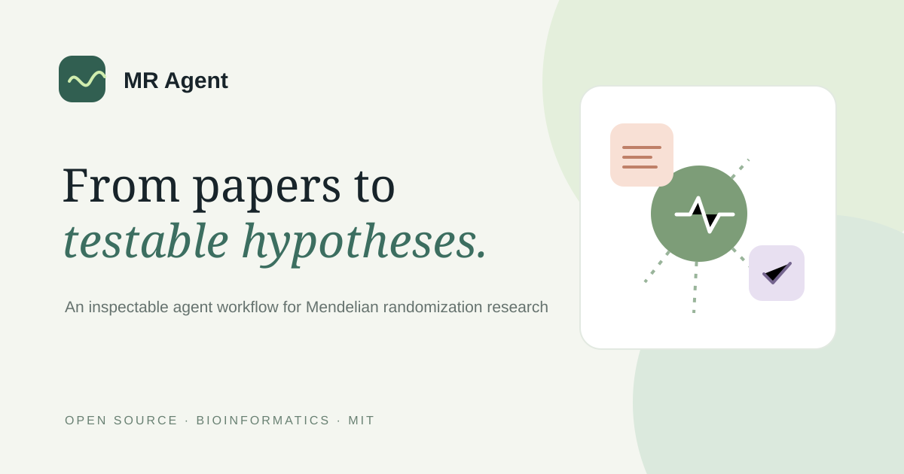

<div align="center">

# MR Agent

### 論文から検証可能な仮説へ

メンデルランダム化研究向けのオープンソース・エージェントスキル。

[English](README.md) · [简体中文](README.zh-CN.md) · [日本語](README.ja.md) · [Español](README.es.md) · [Français](README.fr.md)



</div>

[MRAgent](https://github.com/xuwei1997/MRAgent) を、PubMed での文献探索、GWAS データセットの検索、R を通じた TwoSampleMR の実行、結果レビューまでつなぐ確認可能なワークフローにまとめています。環境チェック、実行ごとの独立ディレクトリ、構造化出力、中間 CSV の確認・編集ツールを追加します。統計手法そのものは MRAgent と R の依存パッケージが提供します。

## 機能

| モード | 内容 |
| --- | --- |
| `O` | アウトカムから候補の曝露を探す |
| `E` | 曝露から候補のアウトカムを探す |
| `OE` | 指定した曝露・アウトカムの組を検証する |

文献探索後に候補の組を確認してから後続ステップへ進む使い方を推奨します。

## 必要環境

- Python 3.11 / 3.12 を推奨し、CI で確認しています。事前チェックは 3.9〜3.12（3.9.7 を除く）を受け入れます。3.9 / 3.10 は CI 未対象、3.13 以降は現在ブロックされます。
- R 4.3.4 以降と [`references/environment.md`](references/environment.md) に記載の R パッケージ。
- 完全な解析には上流 `mragent` パッケージ、LLM バックエンド、OpenGWAS JWT が必要です。

## インストールと実行

```bash
python install.py --target all
python scripts/preflight.py --no-network
python scripts/run_mr.py --mode O --outcome "back pain" --steps 1,2 --dry-run
python scripts/run_mr.py --mode O --outcome "back pain" --steps 1,2
```

生成された `Exposure_and_Outcome.csv` を確認してから、後続 step を実行します。実際の解析ごとに新しい作業ディレクトリを使います。`--dry-run` は設定を表示するだけで、ディレクトリを作りません。

## 安全性と限界

- MR の推定は操作変数、研究デザイン、サンプル重複、データの可用性に左右されます。因果関係の証明、専門家レビューの代替、臨床助言ではありません。
- UMLS 同義語展開はデフォルトでオフです。`--synonyms` を明示すると上流 MRAgent 内蔵の UMLS key が使われます。独立した同義語ツールはユーザー自身の key を要求します。
- GWAS 要約統計量と OpenGWAS カタログ CSV はこのリポジトリに含めません。

## ドキュメントと検証

- [日本語ガイド](docs/ja/getting-started.md) · [全言語ガイド一覧](docs/)
- `python scripts/selftest.py --quick` — ローカル自己テスト
- `python install.py --list` — skill frontmatter の検証

自己テストは補助スクリプトを確認します。完全な MR 解析やライブサービスは実行しません。

## 引用とライセンス

MRAgent の研究利用時は Xu et al., *Briefings in Bioinformatics* (2025), [doi:10.1093/bib/bbaf140](https://doi.org/10.1093/bib/bbaf140) を引用してください。この skill は MIT、上流 MRAgent は Apache-2.0 です。帰属とデータに関する注意は [`NOTICE`](NOTICE) を参照してください。
