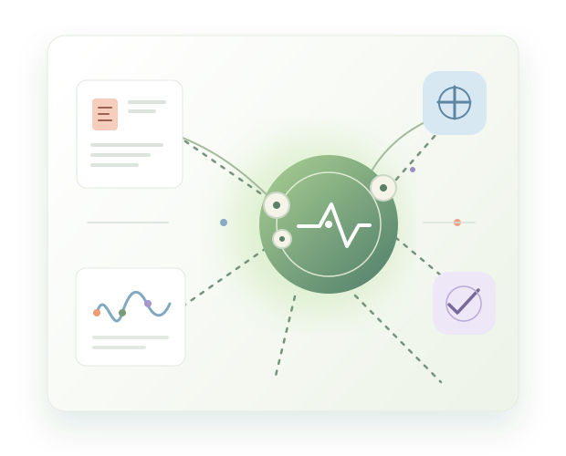

<div align="center">


# MR Agent

### From papers to testable hypotheses

An open-source agent skill for **reviewable Mendelian randomization research**.

[English](README.md) · [简体中文](README.zh-CN.md) · [日本語](README.ja.md) · [Español](README.es.md) · [Français](README.fr.md)

[](https://github.com/cndoin/mr-agent-skills/actions/workflows/ci.yml)
[](LICENSE)
[](docs/en/getting-started.md)
[](docs/README.md)


**[Get started](docs/en/getting-started.md)** · **[Browse documentation](docs/README.md)** · **[Report a security issue](SECURITY.md)**

</div>

MR Agent wraps [MRAgent](https://github.com/xuwei1997/MRAgent) in a workflow you can inspect: discover exposure–outcome candidates in PubMed, look up GWAS datasets, run TwoSampleMR through R, then review the resulting files and reports.

It adds environment checks, isolated run directories, structured command output, result summaries, and tools for reviewing intermediate CSV files. **The statistical methods remain in MRAgent and its R dependencies.**

Beyond upstream, it also ships **SMR (summary-data-based MR) with HEIDI**, which answers a question TwoSampleMR cannot: *which gene mediates this signal?* This is a deliberate capability extension rather than parity work — `--engine official` drives the official `smr` binary with all commonly used flags mapped plus a lossless pass-through, while `--engine native` is a dependency-free implementation whose SMR test matches the official one digit for digit. See [`references/smr.md`](references/smr.md).

## At a glance

| 🔎 Discover | 🧬 Match | 📈 Analyze | ✅ Review |
| --- | --- | --- | --- |
| Find candidate exposure–outcome pairs in the literature. | Search GWAS data and review the selected dataset IDs. | Run MRAgent and TwoSampleMR in R. | Inspect tables, reports, logs, and failure signals. |



The workflow is designed to pause after literature discovery so you can review candidate pairs before moving on to later analysis steps.

## Choose a starting point

| Mode | Start with | Goal |
| --- | --- | --- |
| `O` | An outcome | Find candidate exposures |
| `E` | An exposure | Find candidate outcomes |
| `OE` | An exposure–outcome pair | Validate the specified pair |

## Quick start

### 1. Install the skill

One portable `SKILL.md` works across **Claude Code, WorkBuddy, CodeBuddy, OpenAI Codex, and DeepSeek Harness**. The installer puts it in each agent's native skill directory; it does not install Python, R, or MRAgent dependencies.

```bash
python install.py --target all
python install.py --list
```

Install just one agent with `--target codex` or `--target deepseek`. Codex uses
`$CODEX_HOME/skills/mr-agent` (default `~/.codex/skills/mr-agent`); DeepSeek Harness
uses `$DSH_HOME/skills/mr-agent` (default `~/.dsh/skills/mr-agent`).

You can also install it manually. Platform notes and all supported languages are in the [getting-started guides](docs/README.md).

### 2. Check your environment and preview a run

For a complete MR run, configure an OpenGWAS JWT and the LLM credential required by your backend. Keep credentials in environment variables.

```bash
python scripts/preflight.py --no-network
python scripts/run_mr.py --mode O --outcome "back pain" --steps 1,2 --dry-run
```

### 3. Review candidates before continuing

```bash
python scripts/run_mr.py --mode O --outcome "back pain" --steps 1,2
# Inspect Exposure_and_Outcome.csv before launching later steps.
python scripts/run_mr.py --mode O --outcome "back pain" --steps 3,4,5,6,7,8,9
python scripts/summarize_output.py ./mragent-runs/back_pain_O_*/output
```

Every real run gets a fresh directory under `mragent-runs/`. A dry run prints the planned configuration and does not create a run directory.

## Built for reviewable runs

<table>
<tr>
<td width="50%"><strong>🩺 Preflight before compute</strong><br>Check Python, R, dependencies, credentials, and optional network access before starting.</td>
<td width="50%"><strong>🗂️ Isolated run folders</strong><br>Keep outputs from separate analyses from overwriting each other.</td>
</tr>
<tr>
<td><strong>🧾 Visible failure signals</strong><br>Capture logs and inspect expected output files instead of trusting the upstream exit code alone.</td>
<td><strong>✍️ Human review points</strong><br>Inspect or edit intermediate CSV files before continuing the workflow.</td>
</tr>
</table>

### Included tools

| Tool | Purpose |
| --- | --- |
| `scripts/preflight.py` | Check runtime, dependency, credential, and optional network readiness. |
| `scripts/run_mr.py` | Run MRAgent in a fresh directory and return structured JSON. |
| `scripts/summarize_output.py` | Summarize generated CSV and PDF outputs. |
| `tools/mr_gwas.py` | Search the OpenGWAS catalogue online or from a local cache. |
| `tools/edit_csv.py` · `tools/export_results.py` | Review intermediate tables and package result files. |
| `tools/mr_smr.py` | Run SMR and HEIDI through the official `smr` binary or a dependency-free native engine. |
| More helpers | PubMed, synonyms, LLM calls, evaluation, benchmarking, and the upstream demo. |

## Requirements

- **Python 3.11 or 3.12** is recommended and covered by CI. Preflight accepts Python 3.9–3.12 except 3.9.7; Python 3.9/3.10 are not in CI, and Python 3.13+ is currently blocked by upstream dependency constraints.
- **R 4.3.4 or later**, plus the packages in the [English environment guide](references/en/environment.md).
- For a complete MR run: the upstream `mragent` package, an LLM backend, an OpenGWAS JWT, and network access to the selected services.
- Windows, macOS, and Linux are supported for helper tools. A full MR run also depends on the upstream R setup.

### Optional: use DeepSeek for MRAgent's internal LLM

The agent running this skill (Codex or DeepSeek Harness) is configured separately from the LLM that MRAgent calls during analysis. MRAgent accepts OpenAI-compatible endpoints; set `MRAGENT_AI_KEY` in your environment and pass the model and endpoint to the runner:

```bash
python scripts/run_mr.py --mode O --outcome "back pain" --steps 1,2 --llm-model deepseek-flash --base-url https://api.deepseek.com
```

Check the current model name and API compatibility with [DeepSeek's API documentation](https://api-docs.deepseek.com/guides/agent_integrations/opencode). Never put an actual key in a command, source file, or issue report.

## Safety and scientific scope

- MR estimates depend on instrument quality, study design, sample overlap, and data availability. This workflow does not prove causality, replace expert review, or provide clinical advice.
- Upstream MRAgent can return exit code zero without running an MR. The runner checks for `mr_run.csv` before reporting success.
- Upstream writes the OpenGWAS JWT into a temporary `test.R`; the runner attempts to redact it, and the results exporter excludes it by default. See the [security policy](SECURITY.md) before sharing run files.
- UMLS synonym expansion is **off by default**. Enabling `--synonyms` in the full workflow uses the upstream embedded UMLS key; the standalone synonym tool requires your own key.
- GWAS summary statistics and the 10 MB catalogue CSV are not distributed here. The catalogue is downloaded to a user cache when requested.

## Documentation

<div align="center">

| [🇬🇧 English](docs/en/getting-started.md) | [🇨🇳 简体中文](docs/zh-CN/getting-started.md) | [🇯🇵 日本語](docs/ja/getting-started.md) | [🇪🇸 Español](docs/es/getting-started.md) | [🇫🇷 Français](docs/fr/getting-started.md) |
| --- | --- | --- | --- | --- |

</div>

Detailed implementation references are being translated incrementally. The [English environment guide](references/en/environment.md) is available now; the complete source-level reference set is currently in Chinese. The executable [`SKILL.md`](SKILL.md) is also in Chinese.

## Verify locally

```bash
python scripts/selftest.py --quick
python install.py --list
```

The quick self-test covers helper-script contracts and offline behavior. It does not run a full MR analysis or validate live OpenGWAS, PubMed, R, or LLM services.

## Citation and license

If you use MRAgent in research, cite Xu et al., *Briefings in Bioinformatics* (2025), [doi:10.1093/bib/bbaf140](https://doi.org/10.1093/bib/bbaf140). This skill is MIT licensed; upstream MRAgent is Apache-2.0. See [`NOTICE`](NOTICE) for third-party attribution and data notes.
